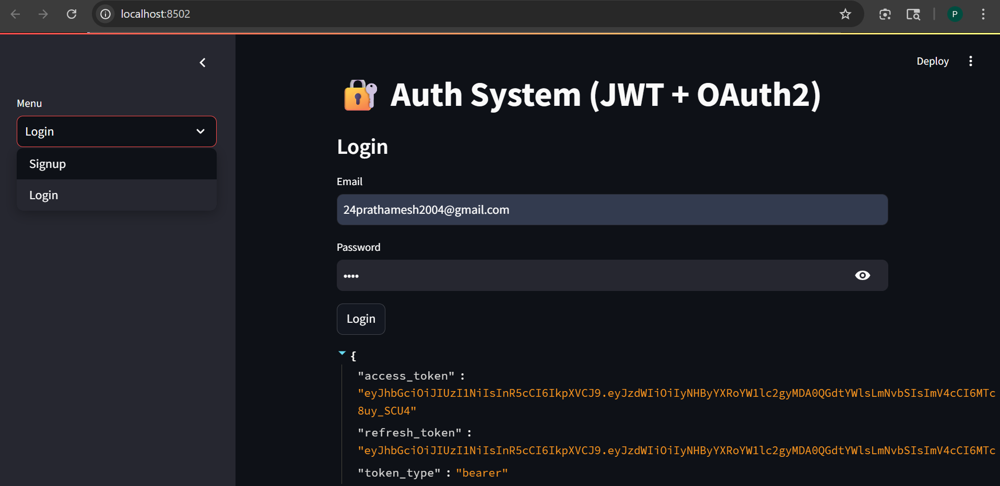
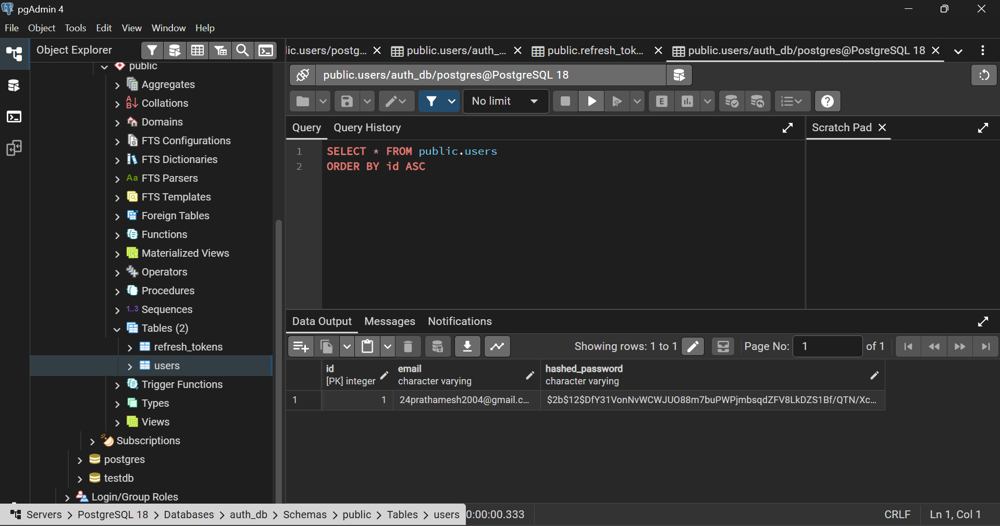

# Day 1 Learning

## Logging
Logging is used to track events in a program. It helps in debugging and monitoring applications. Common levels are debug, info, warning, and error. Debug is used for detailed information, info for general messages, warning for unexpected situations, and error for failures.

## Synchronous and Asynchronous
Synchronous execution runs tasks one after another and waits for each task to complete. Asynchronous execution allows multiple tasks to run without blocking using async and await, improving performance for IO operations.

## Magic Methods
Magic methods are special methods in Python that start and end with double underscores such as __init__ and __str__. They define object behavior like initialization and string representation.

## Mock
Mock is used in testing to simulate real objects or functions. It helps test code independently without relying on external systems like databases or APIs.

## FastAPI
FastAPI is a Python framework used to build APIs quickly. It provides automatic data validation, high performance, and built-in API documentation.

## Routing
Routing defines how an API responds to client requests. It connects a URL path with a function and determines what data is returned.

## Service Layer
Service layer contains business logic and separates it from route handling. This improves code organization and maintainability.

## Database
A database is used to store application data. During initial learning, it can be simulated using in-memory structures like lists or dictionaries before integrating real databases.

## Yield
Yield is used to create generators in Python. It returns values one at a time instead of returning all values at once, which helps in memory efficiency.

## REST API
REST API is a way for client and server to communicate using HTTP methods like GET, POST, PUT, and DELETE. It typically uses JSON format.

## REST vs SOAP
REST is simple, lightweight, and uses JSON. SOAP is more complex, uses XML, and follows strict standards.

## HTTP Methods
POST is used to create new resources. PUT is used to update existing resources. GET is used to retrieve data. DELETE is used to remove data.

## Swagger
Swagger provides automatically generated API documentation. It allows developers to test API endpoints directly from the browser.

## Exception Handling
Exception handling is used to handle runtime errors using try and except blocks. In FastAPI, HTTPException is used to return proper error responses.

---
## Assignment - JWT OAuth2 Authentication System

##  Features
- User Signup & Login  
- JWT Authentication  
- Access Token (short expiry)  
- Refresh Token (long expiry)  
- Password Hashing (bcrypt / argon2)  
- PostgreSQL Integration  
- Logging system  
- Simple Streamlit UI  

---

##  Concepts Used

###  Authentication & Authorization
- OAuth2 Password Flow (simplified)
- Token-based authentication

###  JWT (JSON Web Tokens)
- **Access Token** → used for API access (expires quickly)
- **Refresh Token** → used to generate new access tokens

###  Password Security
- Password hashing using bcrypt / argon2
- No plain-text password storage

###  Database
- PostgreSQL database
- SQLAlchemy ORM for DB operations

###  Backend
- FastAPI for REST APIs
- Dependency Injection for DB sessions

###  Frontend
- Streamlit UI for user interaction
- Displays API responses and tokens

###  Logging
- Logs user activities (signup, login)

---

##  How It Works

1. **Signup**
   - User enters email & password
   - Password is hashed and stored in database

2. **Login**
   - Credentials are verified
   - Generates:
     - Access Token (15 minutes)
     - Refresh Token (7 days)
   - Refresh token stored in database

3. **Access API**
   - Access token is used to access protected endpoints

4. **Refresh Token**
   - When access token expires
   - Refresh token is used to generate a new access token

---
